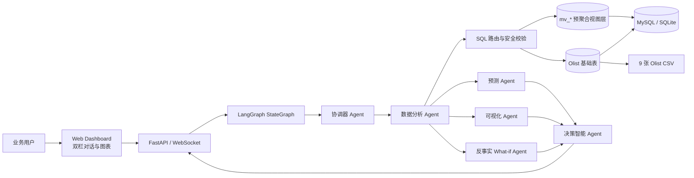
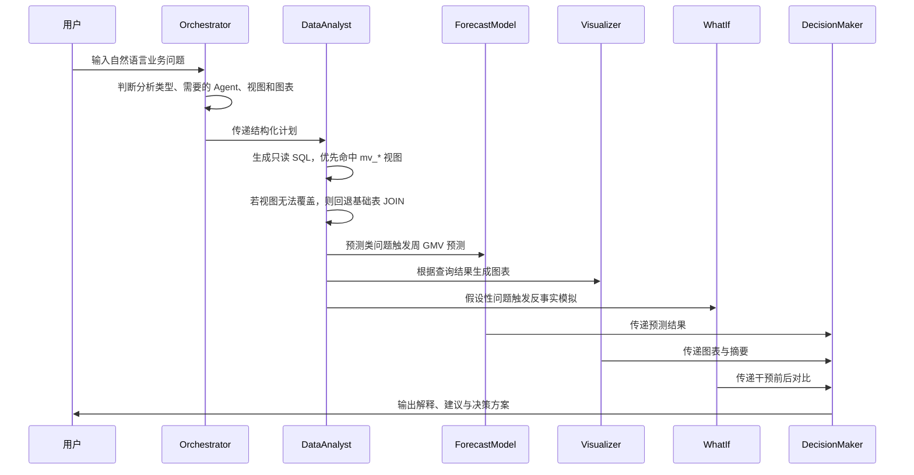
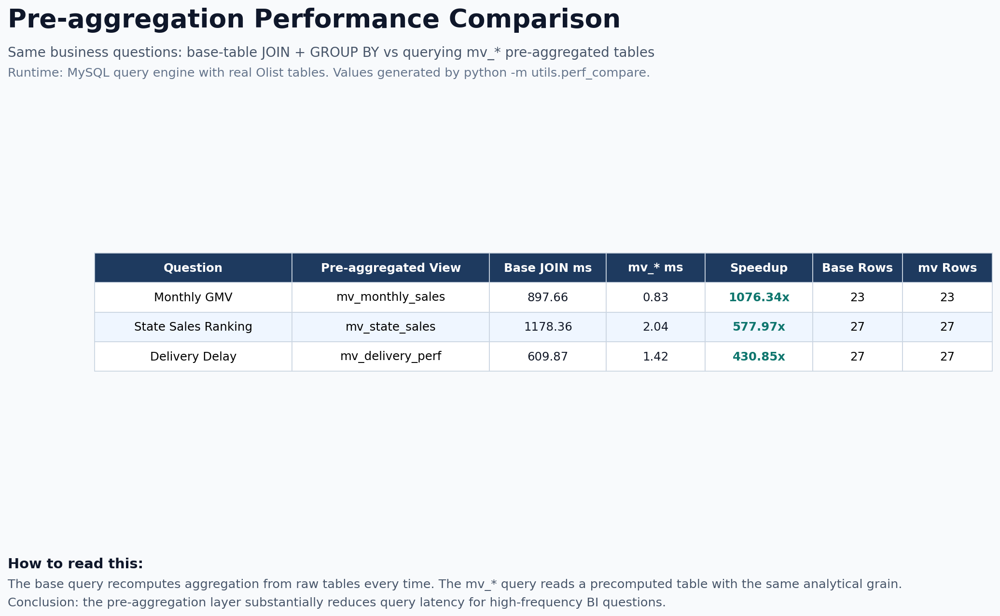
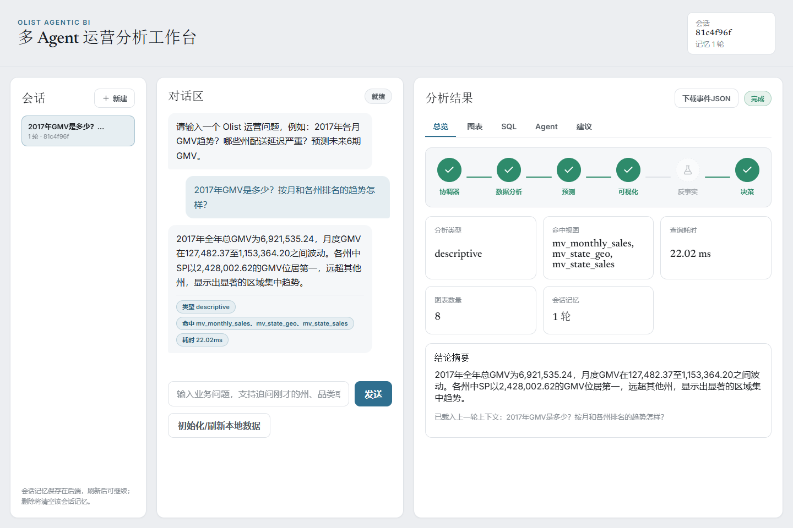
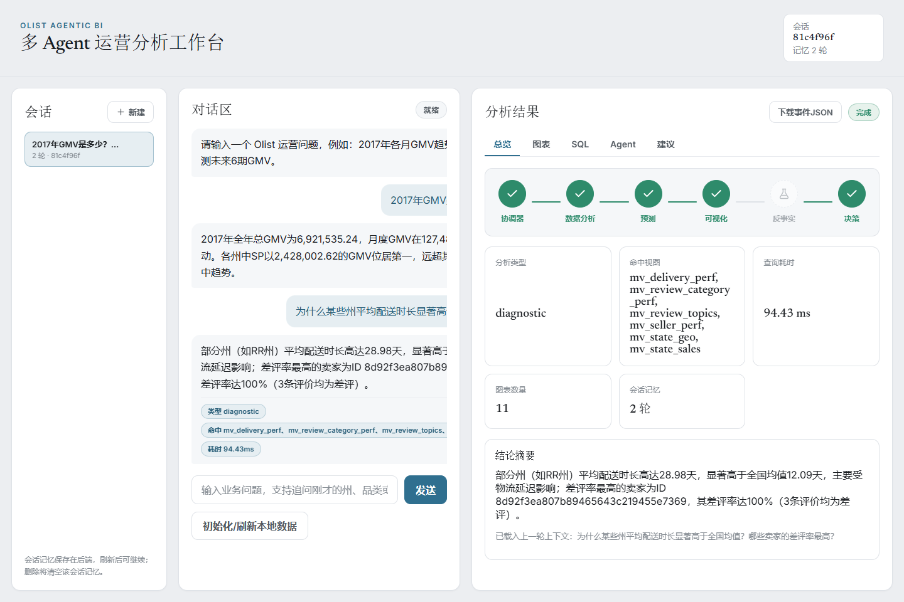
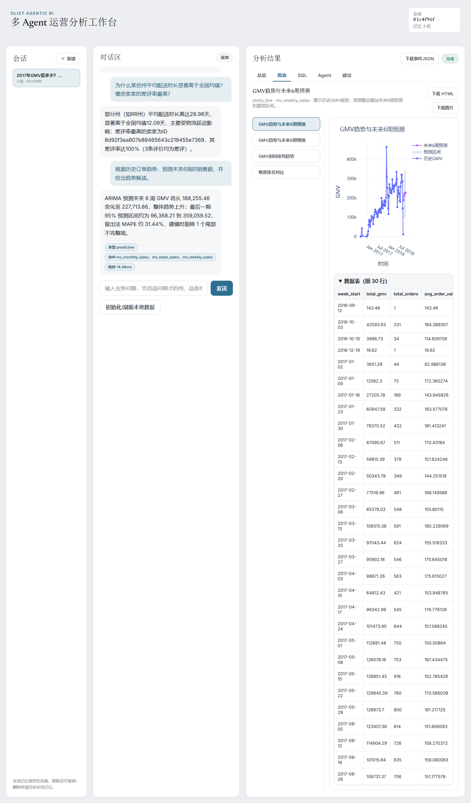
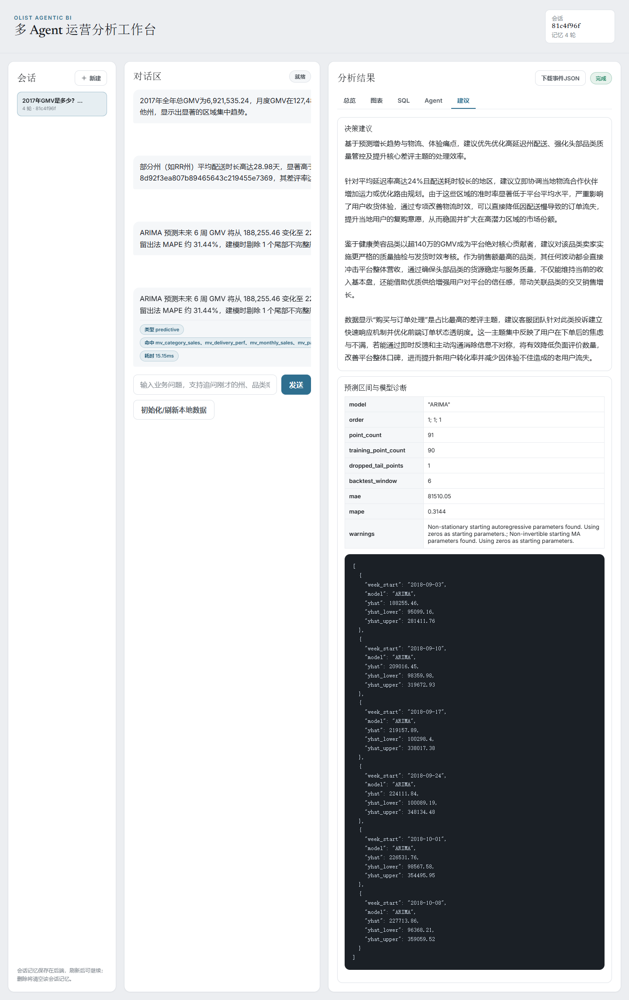
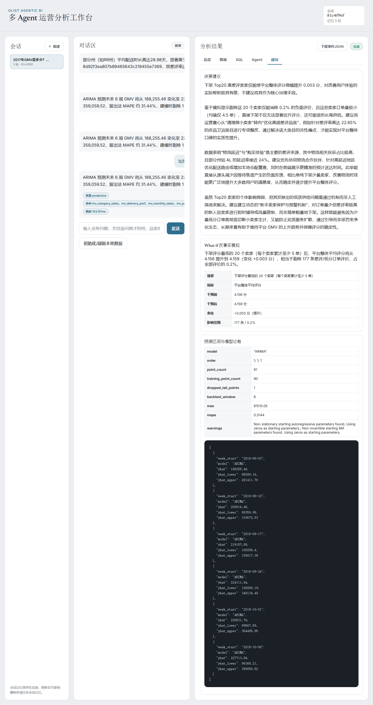
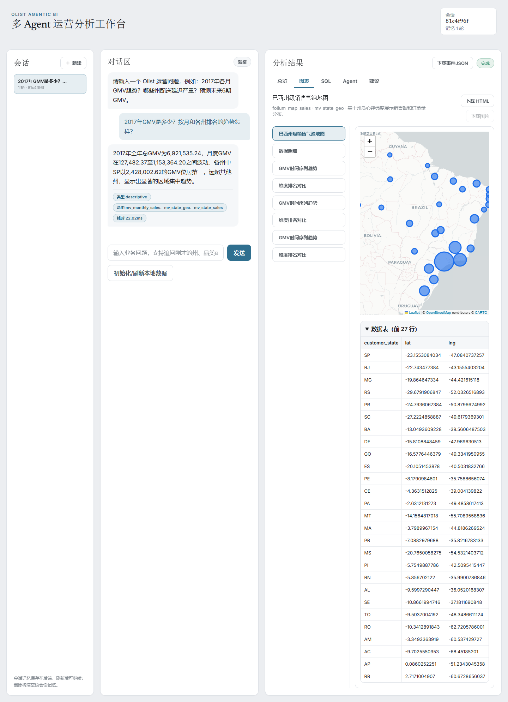
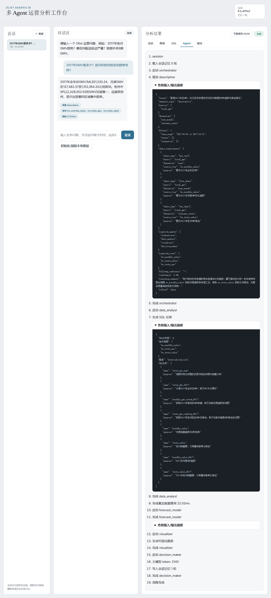

# Agentic BI 驱动的多表电商运营分析与决策智能系统项目报告

2252584 欧宇轩
2252752 刘继业
2253377 李航

## 1. 项目背景与动机

本项目基于 Brazilian E-Commerce Public Dataset by Olist，面向巴西跨境电商平台的运营分析场景，构建一个 Agentic BI 驱动的多表电商运营分析与决策智能系统。传统 BI 往往依赖固定报表和人工 SQL 查询，业务人员提出新问题时需要等待数据同学拆解口径、编写查询、生成图表，再由运营团队进一步解释数据含义。

本系统希望把这一流程自动化：业务用户可以用自然语言提出问题，系统通过多 Agent 协作完成意图理解、SQL 查询、预聚合视图命中、预测建模、可视化生成和决策建议输出。系统重点解决三类问题：

- 让非技术用户能够直接提出运营问题，例如“2017 年哪个州销售额最高？”、“哪些州配送延迟严重？”、“未来 6 周 GMV 如何变化？”。
- 通过预聚合视图降低多表 JOIN 和高频聚合查询的成本，提升 Agent 交互响应速度。
- 将描述性分析、诊断性分析、预测性分析和规范性决策建议整合到一个 Web 工作台中，形成完整的 Agentic BI 体验。

## 2. 系统架构设计

系统整体采用 FastAPI + LangGraph + MySQL/SQLite + Web Dashboard 的结构。查询引擎为 MySQL。Agent 通过统一数据字典理解基础表和预聚合视图，优先查询 `mv_*` 预聚合表；当预聚合层无法覆盖问题维度时，才回退到基础表 JOIN。



Agent 流程如下：



## 3. 关键技术选型说明

| 模块       | 技术选型                               | 说明                                                                                                                                                          |
| ---------- | -------------------------------------- | ------------------------------------------------------------------------------------------------------------------------------------------------------------- |
| LLM        | Qwen / DashScope OpenAI-compatible API | 用于 Orchestrator 结构化规划、DataAnalyst SQL 生成、结果直接作答和 DecisionMaker 建议生成。系统要求模型不可用时明确报错，不以本地生成的预置建议冒充正常结果。 |
| Agent 框架 | LangGraph `StateGraph`                 | 将协调器、数据分析、预测、可视化、反事实模拟、决策建议组织为有状态执行图，通过条件边控制预测和 What-if 分支。                                                 |
| 查询引擎   | MySQL                                  | 基础表与预聚合视图存放于同一数据库，统一通过只读 SQL 访问。                                                                                                   |
| 预聚合层   | `mv_*` 分析表                          | 对月度销售、州销售、品类销售、配送表现、卖家表现、支付分布等高频查询提前计算，减少运行时大 JOIN。                                                             |
| 预测模型   | ARIMA                                  | 基于 `mv_weekly_sales` 的历史周 GMV 序列预测未来 6 周销售额，并输出置信区间和诊断指标。                                                                       |
| 可视化     | Plotly + Folium                        | Plotly 生成折线图、柱状图、热力图、气泡图；Folium 生成巴西州级地图。                                                                                          |
| Web 框架   | FastAPI + 原生 HTML/CSS/JS             | 支持 HTTP API、WebSocket 流式 Agent 事件、会话记忆、图表展示、建议输出和原始事件 JSON 下载。                                                                  |

## 4. 数据集描述与预处理步骤

项目使用 Kaggle Brazilian E-Commerce Public Dataset by Olist，共包含 9 张核心 CSV：

| 表                                  | 说明                                                           |
| ----------------------------------- | -------------------------------------------------------------- |
| `customers`                         | 客户 ID、城市、州、邮编前缀                                    |
| `orders`                            | 订单状态、下单时间、审批时间、发货时间、送达时间、预计送达时间 |
| `order_items`                       | 订单商品、卖家、价格、运费、发货限制时间                       |
| `products`                          | 商品品类、名称长度、描述长度、图片数、重量和尺寸               |
| `sellers`                           | 卖家 ID、城市、州、邮编前缀                                    |
| `order_payments`                    | 支付方式、分期数、支付金额                                     |
| `order_reviews`                     | 评分、评论标题、评论文本、评论创建与回复时间                   |
| `geolocation`                       | 邮编前缀、经纬度、城市、州                                     |
| `product_category_name_translation` | 葡语品类到英文品类的映射                                       |

预处理步骤包括：

- 校验真实 Olist CSV 是否齐全，缺失时明确报错。
- 将空字符串统一处理为空值，避免参与时间和数值计算。
- 将时间字段转换为 `DATETIME` 或标准日期字符串。
- 将金额字段处理为数值类型，如 `price`、`freight_value`、`payment_value`。
- 将评分、分期数、重量、尺寸等字段处理为整数或浮点数。
- 修正 Kaggle 原始字段拼写问题：`product_name_lenght`、`product_description_lenght` 映射为 `product_name_length`、`product_description_length`。
- 利用 `product_category_name_translation` 将葡语品类转为英文品类。
- 核心 GMV、配送、支付、预测统计默认使用 `order_status='delivered'` 的已交付订单，避免取消或未完成订单污染经营指标。

当前本地数据层行数校验结果如下：

| 表                                  |      行数 |
| ----------------------------------- | --------: |
| `customers`                         |    99,441 |
| `geolocation`                       | 1,000,163 |
| `orders`                            |    99,441 |
| `order_items`                       |   112,650 |
| `products`                          |    32,951 |
| `sellers`                           |     3,095 |
| `order_payments`                    |   103,886 |
| `order_reviews`                     |    99,224 |
| `product_category_name_translation` |        71 |

MySQL 初始化入口为：

```bash
python -m utils.db_init --mysql-bootstrap --force
```

该命令会创建数据库和类型化基础表（typed base tables）、清洗导入 9 张 CSV、刷新 SQL 预聚合表，并生成 Python 侧的 `mv_review_topics` 评论主题表。后续可通过以下命令刷新预聚合层和检查行数：

```bash
python -m utils.db_init --mysql-bootstrap
python -m utils.db_init --counts
```

当前 MySQL 预聚合表行数如下：

| 预聚合表                  |   行数 |
| ------------------------- | -----: |
| `mv_monthly_sales`        |     23 |
| `mv_state_sales`          |    556 |
| `mv_category_sales`       |  1,273 |
| `mv_delivery_perf`        |    556 |
| `mv_seller_perf`          | 16,068 |
| `mv_payment_dist`         |    378 |
| `mv_weekly_sales`         |     91 |
| `mv_state_geo`            |     27 |
| `mv_review_category_perf` |     74 |
| `mv_review_topics`        |    454 |
| `mv_weight_freight`       |     10 |

## 5. 预聚合视图和相关处理

### 5.1 预聚合视图列表

当前系统共维护 11 张预聚合分析表。

| 视图                      | 粒度                     | 主要字段                                                                                                                                         | 用途                               |
| ------------------------- | ------------------------ | ------------------------------------------------------------------------------------------------------------------------------------------------ | ---------------------------------- |
| `mv_monthly_sales`        | 年月                     | `year_month`, `total_orders`, `unique_customers`, `total_gmv`, `avg_basket`, `avg_price`, `total_freight`                                        | 月度 GMV、订单数、客单价、运费趋势 |
| `mv_state_sales`          | 年月 + 客户州            | `year_month`, `customer_state`, `total_orders`, `unique_customers`, `total_gmv`, `avg_order_value`                                               | 州级销售排名、区域市场对比         |
| `mv_category_sales`       | 年月 + 品类              | `year_month`, `product_category_name`, `product_category_english`, `total_orders`, `total_items`, `avg_price`, `total_gmv`                       | 品类销售表现和 Top 品类分析        |
| `mv_delivery_perf`        | 年月 + 客户州            | `year_month`, `customer_state`, `avg_delivery_days`, `late_orders`, `delayed_orders`, `on_time_rate`, `late_rate`                                | 配送时长、准时率、延迟风险诊断     |
| `mv_seller_perf`          | 年月 + 卖家              | `year_month`, `seller_id`, `seller_state`, `total_orders`, `total_gmv`, `total_reviews`, `negative_reviews`, `negative_rate`, `avg_review_score` | 卖家绩效、差评卖家定位             |
| `mv_payment_dist`         | 年月 + 支付方式 + 分期数 | `year_month`, `payment_type`, `payment_installments`, `payment_count`, `total_transactions`, `avg_installments`, `payment_value`                 | 支付偏好和分期结构                 |
| `mv_weekly_sales`         | 周                       | `week_start`, `total_orders`, `total_gmv`, `avg_order_value`                                                                                     | 未来 6 周 GMV 预测输入             |
| `mv_state_geo`            | 州                       | `customer_state`, `lat`, `lng`, `total_orders`, `total_gmv`, `avg_order_value`                                                                   | 地理地图与州级销售气泡图           |
| `mv_review_category_perf` | 品类                     | `product_category_name`, `total_reviews`, `avg_review_score`, `negative_reviews`, `negative_rate`, 投诉原因计数                                  | 差评品类和投诉原因诊断             |
| `mv_review_topics`        | 品类 + 主题              | `product_category_name`, `topic_id`, `topic_label`, `topic_keywords`, `complaint_count`, `topic_share`                                           | 负面评论 TF-IDF + NMF 主题建模     |
| `mv_weight_freight`       | 重量区间 + 配送状态      | `weight_bucket`, `delivery_status`, `order_count`, `avg_weight_g`, `avg_volume_cm3`, `avg_freight`, `avg_price`                                  | 商品重量/体积与运费关系            |

### 5.2 SQL 定义摘要

完整 SQL 位于：

- `sql/schema.sql`
- `sql/materialized_views.sql`

核心视图定义示例如下。

#### `mv_monthly_sales`

```sql
CREATE TABLE mv_monthly_sales AS
SELECT
  DATE_FORMAT(o.order_purchase_timestamp, '%Y-%m') AS `year_month`,
  COUNT(DISTINCT o.order_id) AS total_orders,
  COUNT(DISTINCT c.customer_unique_id) AS unique_customers,
  SUM(oi.price + oi.freight_value) AS total_gmv,
  SUM(oi.price + oi.freight_value) / NULLIF(COUNT(DISTINCT o.order_id), 0) AS avg_basket,
  AVG(oi.price) AS avg_price,
  SUM(oi.freight_value) AS total_freight
FROM orders o
JOIN customers c ON o.customer_id = c.customer_id
JOIN order_items oi ON o.order_id = oi.order_id
WHERE o.order_status = 'delivered'
GROUP BY `year_month`;
```

#### `mv_state_sales`

```sql
CREATE TABLE mv_state_sales AS
SELECT
  DATE_FORMAT(o.order_purchase_timestamp, '%Y-%m') AS `year_month`,
  c.customer_state,
  COUNT(DISTINCT o.order_id) AS total_orders,
  COUNT(DISTINCT c.customer_unique_id) AS unique_customers,
  SUM(oi.price + oi.freight_value) AS total_gmv,
  SUM(oi.price + oi.freight_value) / NULLIF(COUNT(DISTINCT o.order_id), 0) AS avg_order_value
FROM orders o
JOIN customers c ON o.customer_id = c.customer_id
JOIN order_items oi ON o.order_id = oi.order_id
WHERE o.order_status = 'delivered'
GROUP BY `year_month`, c.customer_state;
```

#### `mv_delivery_perf`

```sql
CREATE TABLE mv_delivery_perf AS
SELECT
  DATE_FORMAT(o.order_purchase_timestamp, '%Y-%m') AS `year_month`,
  c.customer_state,
  COUNT(DISTINCT o.order_id) AS total_orders,
  AVG(TIMESTAMPDIFF(DAY, o.order_purchase_timestamp, o.order_delivered_customer_date)) AS avg_delivery_days,
  SUM(o.order_delivered_customer_date > o.order_estimated_delivery_date) AS late_orders,
  SUM(o.order_delivered_customer_date > o.order_estimated_delivery_date) AS delayed_orders,
  SUM(o.order_delivered_customer_date <= o.order_estimated_delivery_date) AS on_time_orders,
  SUM(o.order_delivered_customer_date > o.order_estimated_delivery_date) / NULLIF(COUNT(DISTINCT o.order_id), 0) AS late_rate,
  SUM(o.order_delivered_customer_date <= o.order_estimated_delivery_date) / NULLIF(COUNT(DISTINCT o.order_id), 0) AS on_time_rate
FROM orders o
JOIN customers c ON o.customer_id = c.customer_id
WHERE o.order_status = 'delivered'
  AND o.order_delivered_customer_date IS NOT NULL
GROUP BY `year_month`, c.customer_state;
```

#### `mv_payment_dist`

```sql
CREATE TABLE mv_payment_dist AS
SELECT
  DATE_FORMAT(o.order_purchase_timestamp, '%Y-%m') AS `year_month`,
  op.payment_type,
  op.payment_installments,
  COUNT(*) AS payment_count,
  COUNT(*) AS total_transactions,
  AVG(op.payment_installments) AS avg_installments,
  SUM(op.payment_value) AS payment_value
FROM orders o
JOIN order_payments op ON o.order_id = op.order_id
WHERE o.order_status = 'delivered'
GROUP BY `year_month`, op.payment_type, op.payment_installments;
```

#### `mv_seller_perf`

```sql
CREATE TABLE mv_seller_perf AS
SELECT
  DATE_FORMAT(o.order_purchase_timestamp, '%Y-%m') AS `year_month`,
  s.seller_id,
  s.seller_state,
  COUNT(DISTINCT o.order_id) AS total_orders,
  SUM(oi.price + oi.freight_value) AS total_gmv,
  COUNT(DISTINCT r.review_id) AS total_reviews,
  COUNT(DISTINCT CASE WHEN r.review_score <= 2 THEN r.review_id END) AS negative_reviews,
  COUNT(DISTINCT CASE WHEN r.review_score <= 2 THEN r.review_id END) / NULLIF(COUNT(DISTINCT r.review_id), 0) AS negative_rate,
  AVG(r.review_score) AS avg_review_score
FROM orders o
JOIN order_items oi ON o.order_id = oi.order_id
JOIN sellers s ON oi.seller_id = s.seller_id
LEFT JOIN order_reviews r ON o.order_id = r.order_id
WHERE o.order_status = 'delivered'
GROUP BY `year_month`, s.seller_id, s.seller_state;
```

### 5.3 Agent 如何利用预聚合视图

系统通过三层机制保证 Agent 优先使用预聚合视图：

1. 数据字典层：`config/views_desc.py` 维护每张 `mv_*` 视图的名称、粒度、字段和用途。
2. Prompt 层：DataAnalyst 的系统提示要求“优先使用 `mv_monthly_sales`、`mv_state_sales`、`mv_category_sales`、`mv_delivery_perf`、`mv_seller_perf`、`mv_payment_dist`；只有视图无法覆盖时才回退基础表 JOIN”。
3. 路由层：`utils/query_router.py` 会解析 SQL 中的 `FROM` 和 `JOIN` 关系，判断查询是否命中预聚合视图，并在前端展示 `matched_views`。

示例：

- 用户问“2017 年各月 GMV 趋势如何？”时，Agent 应查询 `mv_monthly_sales`。
- 用户问“哪些州配送延迟严重？”时，Agent 应查询 `mv_delivery_perf`，地图题还会补充 `mv_state_geo`。
- 用户问“哪种支付方式最受欢迎，平均分期数是多少？”时，Agent 应查询 `mv_payment_dist`。
- 用户问“查询某个具体订单详情”时，预聚合视图无法覆盖订单明细，Agent 会回退到 `orders`、`order_items`、`order_payments` 等基础表。

### 5.4 性能对比方法与截图

针对月度 GMV、州销售排行、配送延迟三个高频问题，分别执行“基础表 JOIN + GROUP BY”版本与“预聚合表查询”版本，统计两者的查询耗时、返回行数和加速倍数。

本次 MySQL 口径运行结果如下：

| 对比项     | 基础表 JOIN 耗时(ms) | 预聚合表耗时(ms) | 加速倍数 |
| ---------- | -------------------: | ---------------: | -------: |
| 月度 GMV   |               897.66 |             0.83 | 1076.34x |
| 州销售排行 |              1178.36 |             2.04 |  577.97x |
| 配送延迟   |               609.87 |             1.42 |  430.85x |



### 5.5 负面评论主题建模

**原因：** 系统原本用 `mv_review_category_perf` 对差评做粗分类：把葡萄牙语评论文本用关键词 `LIKE` 匹配到物流、质量、错发、客服、其他五类。但 Olist 评论有两个现实困难：一是相当一部分订单没有文字评论，二是葡萄牙语口语表达方式多样，固定关键词清单难以覆盖真实说法。结果是大量差评被归入“其他”，无法回答“顾客到底在抱怨什么”，也就支撑不了运营决策。因此系统在 ETL 阶段补充了一层无监督主题建模，作为差评诊断的预聚合产物 `mv_review_topics`。

**实现方法：** 处理只针对 `review_score<=2` 且有文字内容的负面评论，流程分四步（实现见 `utils/review_topics.py`）：

1. 取数与去重：从 `order_reviews` JOIN `orders`/`order_items` 取出负面评论文本，并按 `review_id` 去重，避免一条评论因订单含多个商品而被重复计入、造成训练样本偏差。
2. TF-IDF 向量化：用 `TfidfVectorizer` 把每条评论转成词频-逆文档频率向量。这里加载了葡萄牙语虚词停用词表（只去掉 `de`、`para` 等无业务含义的功能词，保留 `produto`、`entrega` 等主题词），并启用 1~2 元词组（`ngram_range=(1,2)`），让“não chegou（没送到）”这类短语也能成为特征。
3. NMF 主题分解：用非负矩阵分解（NMF）把 TF-IDF 矩阵分解为若干主题成分，每个主题取权重最高的若干关键词作为主题标签；再把每条评论指派给其权重最大的主导主题。
4. 按品类聚合落表：统计每个 `(品类, 主题)` 的投诉条数与占比，并额外生成一行 `ALL` 平台级主题，写入 `mv_review_topics`（字段为 `product_category_name`、`topic_id`、`topic_label`、`topic_keywords`、`complaint_count`、`topic_share`）。

整个模型在本地 ETL 阶段秒级训练，无需下载任何预训练模型；运行时 Agent 只读取这张预聚合表，不增加在线问答的计算负担。

**作用与效果：** 主题建模能从数据中自动学出关键词清单遗漏的投诉原因，例如：

- `comprei dois · recebi apenas`（买了两件只收到一件）对应“漏发缺件”。
- `compra · pedido · dia`（下单·订单·天数）对应“等待时间长、物流拖延”。

诊断阶段，DataAnalyst 把 `mv_review_topics` 作为差评成因的证据；DecisionMaker 再据此给出履约防漏发、物流提速、质检与售后流程优化等针对性建议，形成“非结构化文本 → 主题洞察 → 决策建议”的闭环。

### 5.6 What-if 反事实模拟

**原因：** 描述性和诊断性分析回答“发生了什么、为什么”，但运营方真正想知道的是“如果我采取某个动作，指标会怎样变化”。What-if 反事实模拟就是为回答这类假设性问题而设计的：它建立在数据层之上，在真实数据上推演“干预前 → 干预后”的指标差异，为决策建议提供量化依据（实现见 `utils/whatif.py`）。

**触发方式：** 当用户问题中出现“如果、假设、下架、移除、剔除”等反事实意图时，LangGraph 条件边会触发 `whatif_model` 节点。该节点先由大模型把自然语言假设映射到一个预置场景（映射失败时按关键词确定性兜底到最贴近的场景），再执行对应的确定性计算。当前已落地两个场景：

- 下架评分最低的 Top-N 卖家后，平台整体平均评分如何变化。
- 消除所有延迟订单（让其全部按时送达）后，平台整体平均评分如何变化。

这两个场景以场景注册表的形式组织：每个场景对应一个确定性计算函数，大模型只在已注册场景中做选择，并可从问题中解析参数（如下架数量 `top_n`、卖家最小单量门槛 `min_orders`）。因此用户提问的措辞可以灵活（“砍掉/移除/停用最差的若干卖家”都能命中同一场景），未来新增反事实场景也只需注册一个新的计算函数即可扩展；当前落地的是上述两个代表性场景。

**计算方法：** 反事实的本质是“在真实数据上排除某一子群体后重算指标”，而不是凭空编造数据：基线和反事实都来自同一批真实评价，差异只来自“保留还是排除哪一批订单/评价”。具体做法是给每条评价打一个 `keep` 标记（1 表示干预后仍保留），用一趟 SQL 扫描同时算出干预前均分（全部评价）和干预后均分（仅 `keep=1` 的评价），比分两次查询各扫一遍快近一倍。两个场景的区别只在 `keep` 的判定条件：下架卖家场景用 `NOT EXISTS` 判断该评价对应订单是否含被下架卖家的商品；消除延迟场景判断该订单是否实际送达晚于预计送达日。其中下架场景还体现了“视图优先”：系统先从预聚合的 `mv_seller_perf` 中毫秒级选出最差卖家，只在最后重算平台评分时才下钻一次基础表。

**实测结论：** 下架最差 20 个卖家，平台均分约从 4.142 提升到 4.145，仅提升 +0.003，影响 181 条评价；而消除配送延迟，平台均分约从 4.142 提升到 4.283，提升 +0.141，影响约 8.1% 的评价。两相对比说明：平台体验的短板更可能来自系统性的物流履约，而非少数长尾差评卖家。因此运营资源应优先投向高延迟区域的履约改善，而不是简单地大规模下架卖家——这正是反事实模拟相比单纯看指标排名所能多提供的决策价值。

## 6. 智能体实现与多智能体调度方法

系统包含以下 Agent：

| Agent                        | 文件/模块                                         | 职责                                                                               |
| ---------------------------- | ------------------------------------------------- | ---------------------------------------------------------------------------------- |
| Orchestrator 协调器 Agent    | `agents/orchestrator.py`                          | 调用 LLM 生成结构化计划，判断分析类型、指标、维度、需要的视图、图表和 Agent 路径。 |
| DataAnalyst 数据分析 Agent   | `agents/data_analyst.py`                          | 将自然语言问题转换为只读 SQL，优先使用预聚合视图，执行查询并生成数据摘要和直答。   |
| ForecastModel 预测 Agent     | `models/forecast.py`                              | 对 `mv_weekly_sales` 的历史周 GMV 序列训练 ARIMA，预测未来 6 周销售额和置信区间。  |
| Visualizer 可视化 Agent      | `agents/visualizer.py`                            | 根据查询结果自动选择图表类型，并生成 Plotly/Folium HTML 图表。                     |
| DecisionMaker 决策智能 Agent | `agents/decision_maker.py`                        | 综合数据摘要、预测结果、What-if 结果，调用 LLM 输出业务建议。                      |
| WhatIf 反事实模拟 Agent      | `utils/whatif.py` + `agents/orchestrator.py` 节点 | 对“如果下架 Top N 高差评卖家”等假设进行干预前后重算，评估运营动作影响。            |

LangGraph 调度流程：

1. Orchestrator 作为入口节点，先生成结构化计划。
2. DataAnalyst 根据计划生成 SQL 并执行查询。
3. Orchestrator refine 节点根据真实查询结果修正规划，例如检测到周度序列时触发预测。
4. 预测类问题进入 ForecastModel。
5. 所有问题进入 Visualizer 生成图表。
6. 如果问题包含“如果、假设、下架、移除”等反事实意图，则进入 WhatIf 节点。
7. 最后由 DecisionMaker 输出解释和建议。

## 7. 分析任务覆盖与运行结果

### 7.1 描述性分析

示例问题：

> 2017 年 GMV 是多少？按月和各州排名的趋势怎样？

预期命中视图：

- `mv_monthly_sales`
- `mv_state_sales`

分析解释：

系统通过月度销售视图获得每月 GMV 和订单数趋势，通过州销售视图获得不同州的 GMV 排名和订单贡献。描述性分析重点回答“发生了什么”，例如哪个月份销售额较高、哪个州贡献最大、整体订单趋势是否上升。

截图位置：



### 7.2 诊断性分析

示例问题：

> 为什么某些州的平均配送时长显著高于全国均值？哪些卖家的差评率最高？

预期命中视图：

- `mv_delivery_perf`
- `mv_seller_perf`
- `mv_review_category_perf`
- `mv_review_topics`

分析解释：

诊断性分析不只展示指标，还会定位潜在原因。系统会对比各州平均配送时长、延迟率和延迟订单数，同时结合卖家差评率、品类差评率和评论主题，判断问题更可能来自物流履约、卖家质量还是商品体验。

截图位置：



### 7.3 预测性分析

示例问题：

> 根据历史订单趋势，预测未来 6 周的销售额，并给出趋势解读。

预期命中视图：

- `mv_weekly_sales`
- `mv_monthly_sales`

分析解释：

ForecastModel 使用 `mv_weekly_sales` 中的真实周 GMV 序列训练 ARIMA 模型，输出未来 6 周的 `yhat`、`yhat_lower` 和 `yhat_upper`。可视化 Agent 将历史趋势线、预测线和置信区间放在同一张折线图中，便于业务方理解趋势和不确定性。

截图位置：



### 7.4 规范性分析与决策建议

示例问题：

> 基于全部分析结果，给出平台 3 个月内的三大优先改进策略。

预期命中视图：

- `mv_monthly_sales`
- `mv_state_sales`
- `mv_delivery_perf`
- `mv_category_sales`
- `mv_payment_dist`
- `mv_review_category_perf`
- `mv_review_topics`

分析解释：

规范性分析重点回答“应该怎么做”。系统会综合销售趋势、区域表现、配送履约、支付结构、差评品类和评论主题，输出可执行建议。例如优先改善延迟率较高州的物流能力、对高差评卖家进行分层治理、对差评集中品类优化质检和售后流程。

截图位置：



### 7.5 What-if 反事实模拟

示例问题：

> 如果将 Top 20 高差评卖家的商品统一下架，平台整体评分预估提升多少？

实现方式：

- 首先从 `mv_seller_perf` 中选择评分最低或差评风险最高的 Top N 卖家。
- 计算干预前平台整体平均评分。
- 假设这些卖家的订单评价被排除，重新计算干预后平台整体平均评分。
- 对比干预前后差值，判断该策略是否值得优先执行。

示例结论：

下架最差 20 个卖家后，平台平均评分提升幅度较小；而消除延迟订单对评分提升更明显。这说明平台体验问题更可能来自系统性物流履约，而不是少数长尾卖家的单点问题。因此运营资源应优先投入高延迟州的履约改善，而不是简单大规模下架卖家。

截图位置：



## 8. 可视化与仪表板交互

系统 Web 页面采用对话区 + 结果区的工作台布局。左侧支持多轮问答和会话切换，右侧按标签展示总览、图表、SQL、Agent 事件和建议。

当前支持的图表类型包括：

- 时间序列折线图：月度 GMV 和未来 6 周预测。
- 地理气泡地图：巴西州级销售、配送延迟、准时率或卖家风险。
- 柱状图/条形图：州销售排行、品类销售排行、支付方式频率。
- 热力图：支付方式与分期数矩阵。
- 气泡散点图：商品重量/体积与运费关系。
- 堆叠条形图：差评品类与投诉原因结构。
- 数据表：展示图表背后的 SQL 查询结果。

运行结果截图位置：






## 9. 技术挑战与解决方案

| 挑战                                     | 解决方案                                                                                                                |
| ---------------------------------------- | ----------------------------------------------------------------------------------------------------------------------- |
| 多表 JOIN 查询慢，Agent 高频交互容易超时 | 建立 `mv_*` 预聚合表，将高频维度提前计算；Agent 优先查询视图，显著减少运行时 JOIN 和 GROUP BY 成本。                    |
| LLM 可能生成危险 SQL 或错误 SQL          | 仅允许 `SELECT` / `WITH`，拦截 `INSERT`、`UPDATE`、`DELETE`、`DROP` 等危险语句；SQL 执行失败后允许有限次数让 LLM 修复。 |
| 用户问题维度复杂，单条 SQL 难以覆盖      | DataAnalyst 将问题拆成 1 到 6 个 SQL 任务，分别查询销售、配送、支付、评价、地图、预测等证据。                           |
| 地图题容易只查销售，不查地理坐标         | 增加 `mv_state_geo`，并在地图需求中补充经纬度证据查询。                                                                 |
| 评论文本为葡萄牙语，关键词分类覆盖不足   | 引入 TF-IDF + NMF 主题建模，生成 `mv_review_topics`，用于识别差评主题。                                                 |
| 预测尾部周数据可能不完整                 | ForecastModel 检查尾部异常低值，必要时剔除不完整尾周，并输出诊断信息。                                                  |
| 决策建议容易空泛                         | DecisionMaker 的 prompt 要求建议必须围绕真实数据摘要，说明“做什么、为什么、改善什么”。                                  |
| 多轮问答容易被历史上下文污染             | 只有出现“继续、刚才、该州、这个品类”等追问词或失败重试时才注入最近会话上下文。                                          |

## 10. 小组分工和比例

| 成员   | 主要工作                                                                                                                                                                                                                                                                                          | 比例 |
| ------ | ------------------------------------------------------------------------------------------------------------------------------------------------------------------------------------------------------------------------------------------------------------------------------------------------- | ---: |
| 刘继业 | 数据与性能层：9 表 ETL 清洗（类型/空值/时间字段）、MySQL 建库导入与统一查询入口（`mysql_store.py`/`db_init.py`/`local_store.py`）、预聚合视图设计（`materialized_views.sql`/`views_desc.py`）、DataAnalyst 视图优先与基础表回退查询逻辑（卖家差评率、配送证据）、性能对比脚本与截图、数据校验文档 |  33% |
| 李航   | Agent 编排：Orchestrator 结构化规划、LangGraph 多 Agent 调度与条件边、会话记忆与多会话实现、DecisionMaker 决策建议、负面评论 NMF 主题建模、What-if 反事实模拟                                                                                                                                     |  33% |
| 欧宇轩 | 演示与可视化：Visualizer 自动选图与 Plotly/Folium 图表、Web Dashboard 前端与多轮交互、ForecastModel（ARIMA 预测 + 置信区间 + 留出法回测）、运行结果截图与报告整理                                                                                                                                 |  33% |

## 11. 总结

本项目围绕 Olist 多表电商数据集实现了一个可运行的 Agentic BI 系统。系统通过 LangGraph 编排多个 Agent，结合 Qwen 大模型、SQL 查询、预聚合视图、时间序列预测、可视化图表和决策建议，支持非技术用户用自然语言完成运营分析。

项目的核心亮点包括：

- 使用 11 张预聚合视图覆盖销售、区域、品类、配送、卖家、支付、评论和运费等高频分析维度。
- DataAnalyst 具备视图优先查询和基础表回退机制。
- ForecastModel 基于真实周 GMV 序列进行未来 6 周预测。
- What-if Agent 支持反事实运营模拟，例如评估下架高差评卖家的评分提升效果。
- Web Dashboard 集成对话、SQL、图表、Agent 事件和建议输出，形成完整 Agentic BI 体验。

从性能对比结果看，预聚合视图显著降低了查询耗时。以月度 GMV 为例，MySQL 基础表 JOIN 聚合耗时约 897.66 ms，而预聚合视图查询耗时约 0.83 ms，加速超过 1,000 倍。这说明在 Agent 高频调用数据的场景中，预聚合层是保证交互体验和系统稳定性的关键设计。
