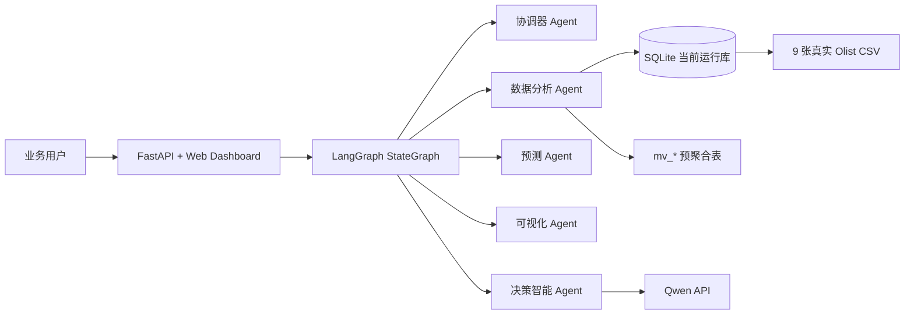

# Olist Agentic BI 项目报告草稿

## 1. 项目背景

本项目基于 Brazilian E-Commerce Public Dataset by Olist，面向非技术业务用户提供自然语言 BI 分析能力。系统接收运营问题后，由多 Agent 协作完成 SQL 查询、预聚合视图命中、图表展示、预测分析和决策建议。

## 2. 架构设计



当前因 MySQL 服务器尚未就绪，运行时暂用 SQLite；表结构、预聚合视图命名和 SQL 脚本保持 MySQL 可迁移。

## 3. 关键技术选型

- LLM：Qwen/DashScope OpenAI-compatible API，负责 SQL 任务规划和业务建议生成。
- Agent 编排：LangGraph `StateGraph`，节点包括 Orchestrator、DataAnalyst、ForecastModel、Visualizer、DecisionMaker。
- 查询引擎：当前 SQLite，本地库由真实 CSV 构建；后续迁移 MySQL。
- 预测模型：基于真实 `mv_weekly_sales` 周 GMV 序列，输出未来 6 周预测值和置信区间。
- Web：FastAPI + WebSocket 流式输出，前端双栏展示对话、SQL、图表、建议和 JSON。

## 4. 数据预处理与预聚合

系统启动或刷新时核验 9 张真实 Olist CSV，缺失则尝试从公开镜像下载真实 CSV。导入后建立基础表、索引和 10 张预聚合表：

`mv_monthly_sales`、`mv_state_sales`、`mv_category_sales`、`mv_delivery_perf`、`mv_seller_perf`、`mv_payment_dist`、`mv_weekly_sales`、`mv_state_geo`、`mv_review_category_perf`、`mv_weight_freight`。

DataAnalyst 的提示词注入基础表和预聚合表数据字典，要求大模型优先生成命中 `mv_*` 的只读 SQL。代码层定位为大模型的"安全护栏 + 确定性证据模板"：

- 业务 SQL 规划与查询结果的自然语言直答均由大模型实时完成，代码不再用写死 if-else 拼装答案；
- 仅保留一组确定性的 `mv_*` 证据查询模板（如地图所需的州级经纬度 JOIN、预测所需的周 GMV 序列），用于保证地图/预测这类机械取数稳定可复现——这类查询用大模型每次重写反而易引入偏差；
- 所有 SQL 经过只读校验、危险语句拦截和 SQLite 方言规整后才执行，非法或缺数据时明确报错。

## 5. 可视化覆盖

- 月度 GMV 折线图。
- 未来 6 周预测曲线与置信区间。
- 巴西州级销售气泡地图。
- 州/品类/支付方式柱状图。
- 支付方式与分期数热力图。
- 重量/体积与运费气泡散点图。

## 6. 验证方式

```bash
python cli.py --validate-assignment
python -m pytest -q tests -p no:cacheprovider
uvicorn app:app --reload
```

附录 10 个问题通过 `--validate-assignment` 批量验收，输出每题的分析类型、命中视图、SQL 任务数、直答、图表和预测状态。

## 7. 错误处理原则

模型失败、API Key 无效、数据缺失、SQL 非法时均返回明确错误；系统不生成本地假建议、不构造模拟 CSV、不用特值 SQL 冒充大模型规划结果。
