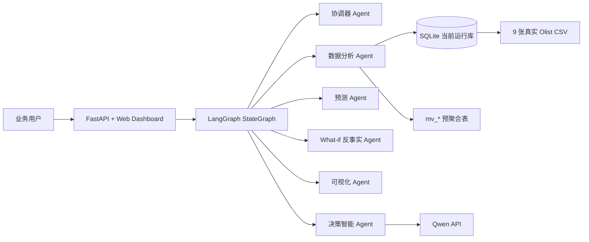

# Olist Agentic BI 项目报告草稿

## 1. 项目背景

本项目基于 Brazilian E-Commerce Public Dataset by Olist，面向非技术业务用户提供自然语言 BI 分析能力。系统接收运营问题后，由多 Agent 协作完成 SQL 查询、预聚合视图命中、图表展示、预测分析和决策建议。

## 2. 架构设计



当前因 MySQL 服务器尚未就绪，运行时暂用 SQLite；表结构、预聚合视图命名和 SQL 脚本保持 MySQL 可迁移。

## 3. 关键技术选型

- LLM：Qwen/DashScope OpenAI-compatible API，负责 SQL 任务规划和业务建议生成。
- Agent 编排：LangGraph `StateGraph`，节点包括 Orchestrator、DataAnalyst、ForecastModel、WhatIf（反事实模拟，按问题意图条件触发）、Visualizer、DecisionMaker。
- 查询引擎：当前 SQLite，本地库由真实 CSV 构建；后续迁移 MySQL。
- 预测模型：基于真实 `mv_weekly_sales` 周 GMV 序列，输出未来 6 周预测值和置信区间。
- Web：FastAPI + WebSocket 流式输出，前端双栏展示对话、SQL、图表、建议和 JSON。

## 4. 数据预处理与预聚合

系统启动或刷新时核验 9 张真实 Olist CSV，缺失则尝试从公开镜像下载真实 CSV。导入后建立基础表、索引和 11 张预聚合表：

`mv_monthly_sales`、`mv_state_sales`、`mv_category_sales`、`mv_delivery_perf`、`mv_seller_perf`、`mv_payment_dist`、`mv_weekly_sales`、`mv_state_geo`、`mv_review_category_perf`、`mv_review_topics`、`mv_weight_freight`。

DataAnalyst 的提示词注入基础表和预聚合表数据字典，要求大模型优先生成命中 `mv_*` 的只读 SQL。代码层定位为大模型的"安全护栏 + 确定性证据模板"：

- 业务 SQL 规划与查询结果的自然语言直答均由大模型实时完成，代码不再用写死 if-else 拼装答案；
- 仅保留一组确定性的 `mv_*` 证据查询模板（如地图所需的州级经纬度 JOIN、预测所需的周 GMV 序列），用于保证地图/预测这类机械取数稳定可复现——这类查询用大模型每次重写反而易引入偏差；
- 所有 SQL 经过只读校验、危险语句拦截和 SQLite 方言规整后才执行，非法或缺数据时明确报错。

### 4.1 负面评论主题建模（加分项：NLP 情感/主题分析融入决策）

原 `mv_review_category_perf` 用葡萄牙语关键词 LIKE 把差评粗分为物流/质量/错发/客服/其他，由于约六成评论无文本、且大量措辞不命中关键词，**超 70% 差评落入"其他"黑洞**，无法支撑经营决策。

为此引入 `utils/review_topics.py`：在 ETL 阶段对 `review_score<=2` 的葡语评论文本做 **TF-IDF + NMF 无监督主题建模**（scikit-learn），自动学习数据驱动的差评主题，按品类聚合落地为 `mv_review_topics`（含 `topic_label`、`topic_keywords`、`complaint_count`、`topic_share`，并含 `ALL` 平台级行）。模型本地训练秒级、无需下载预训练模型，运行时只查预聚合结果、零额外负担。

实测主题揭示了关键词分类完全遗漏的真实根因——如"付款后未收到货 / 漏发缺件"（`comprei dois · recebi apenas`）与"下单后物流拖延"（`compra · pedido · dia`）。DataAnalyst 将该结果作为证据，DecisionMaker 据此输出针对履约漏发、物流提速的具体改进建议，完成"NLP 分析→决策建议"的闭环。

### 4.2 What-if 反事实模拟（加分项：What-if 模拟分析）

任务书要求决策智能体支持"反事实推演"——给定一个假设干预，重算某个聚合指标并对比干预前后。系统新增独立的 **WhatIf Agent 节点**（`agents/orchestrator.py` 的 `whatif_model`）：当协调器在问题中识别到"如果/假设/下架/移除"等反事实意图时，条件边把流程导向该节点；节点由大模型把自然语言假设映射到预置场景（失败时退回关键词兜底），再调用 `utils/whatif.py` 在真实订单数据上做确定性重算。

计算本身保持确定性、可复现：基线与反事实来自同一批真实评价，差异只来自"排除哪一批数据"，绝不模拟编造。已落地两个场景：

- **下架评分最低的 Top-N 卖家 → 平台平均评分变化**：最差卖家直接取自预聚合视图 `mv_seller_perf`（毫秒级，符合视图优先理念），仅反事实重算才下钻基础表，用一趟扫描（`CASE WHEN NOT EXISTS ...`）同时算出干预前后均分。
- **消除所有延迟订单 → 平台平均评分变化**。

实测两场景形成了有价值的数据对比：**下架最差 20 个卖家，平台均分仅从 4.142 升到 4.145（+0.003，仅影响 181 条评价）；而消除配送延迟，均分从 4.142 升到 4.283（+0.141，影响 8.1% 的评价）**。据此 DecisionMaker 给出"问题不在个别长尾卖家、而在系统性物流与履约"的数据驱动优先级建议——这正是 Agentic BI 从"看数"走向"决策"的体现。

> 性能保障：建库末尾执行 `ANALYZE` 收集统计信息，避免 SQLite 在缺统计时为多表 JOIN 临时自建索引（曾导致反事实查询退化到分钟级）；反事实场景仅在用户显式提出假设性问题时触发，不增加常规问答负担。

## 5. 可视化覆盖

- 月度 GMV 折线图。
- 未来 6 周预测曲线与置信区间。
- 巴西州级销售气泡地图。
- 州/品类/支付方式柱状图。
- 支付方式与分期数热力图。
- 重量/体积与运费气泡散点图。

## 6. 验证方式

```bash
python cli.py --validate-assignment
python -m pytest -q tests -p no:cacheprovider
uvicorn app:app --reload
```

附录 10 个问题通过 `--validate-assignment` 批量验收，输出每题的分析类型、命中视图、SQL 任务数、直答、图表和预测状态。

## 7. 错误处理原则

模型失败、API Key 无效、数据缺失、SQL 非法时均返回明确错误；系统不生成本地假建议、不构造模拟 CSV、不用特值 SQL 冒充大模型规划结果。
